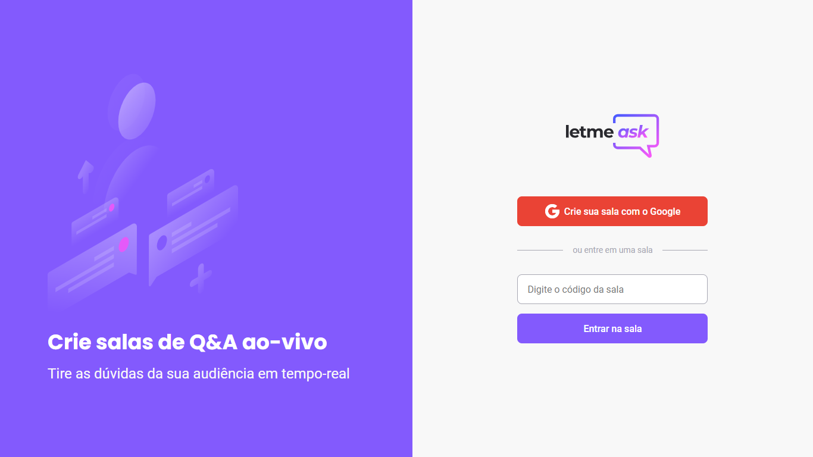
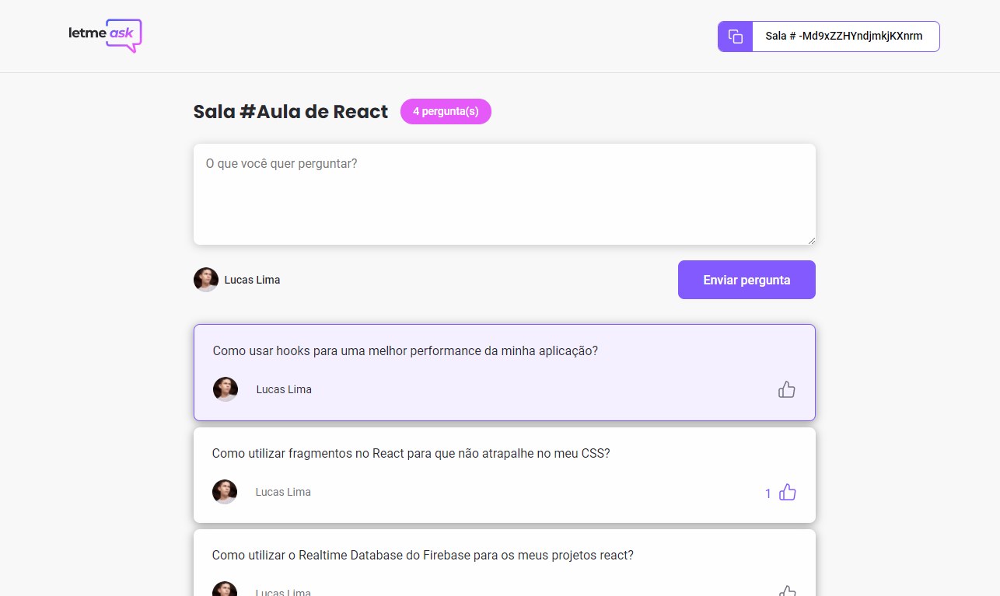
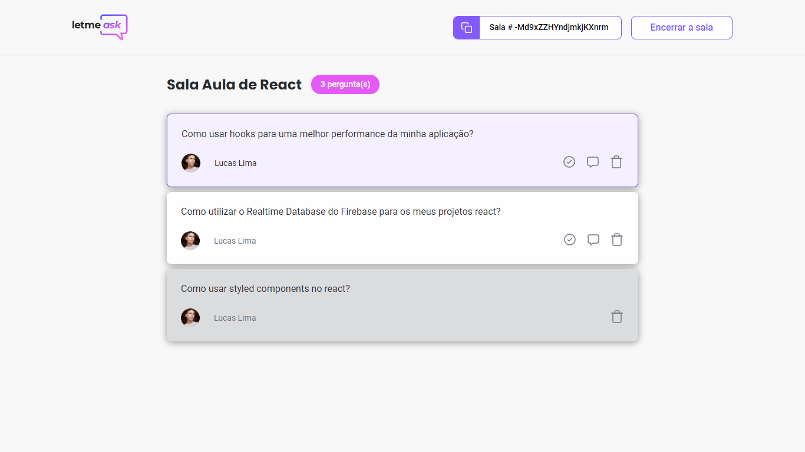

  

  
  
  

     

<h1 align="center">
    
    
    
</h1>

 

## 💻 Projeto

Letmeask é um projeto com o intuito de ajudar criadores de conteúdo a organizarem melhor suas lives, por meio de uma aplicação que gerencia salas onde seus espectores mandam perguntas.

## 🚀 Tecnologias

Tecnologias Utilizadas neste projeto: 

- [React](https://reactjs.org)
- [Firebase](https://firebase.google.com/)
- [TypeScript](https://www.typescriptlang.org/)
- [Sass](https://sass-lang.com/)

## ⚙️ Funcionalidades

- Autenticação com google;
- Criação de sala;
- Input para inserção novas perguntas;
- Sistema de likes para perguntas;
- Destaque para pergunta que esta sendo respondida (Highlighted);
- Destaque para perguntas que já foram respondidas (Answered);
- Exclusão de perguntas;
- Encerramento de sala.

## 📝 License

Esse projeto está sob a licença MIT. Veja o arquivo [LICENSE](LICENSE.md) para mais detalhes.

---

Projeto desenvolvido por Lucas Lima durante a #NLW 06 da Rocketseat.
